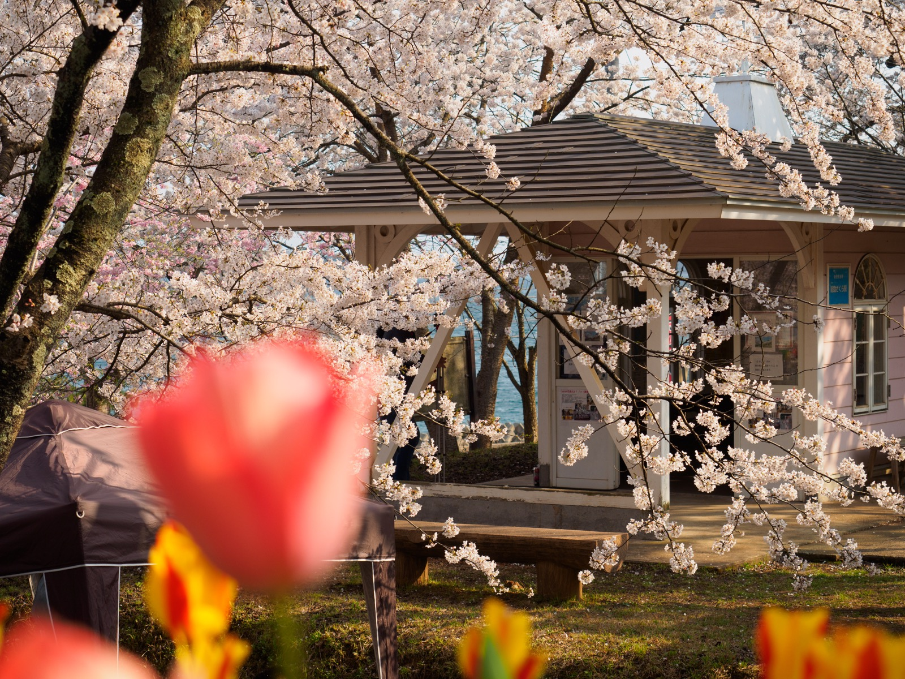
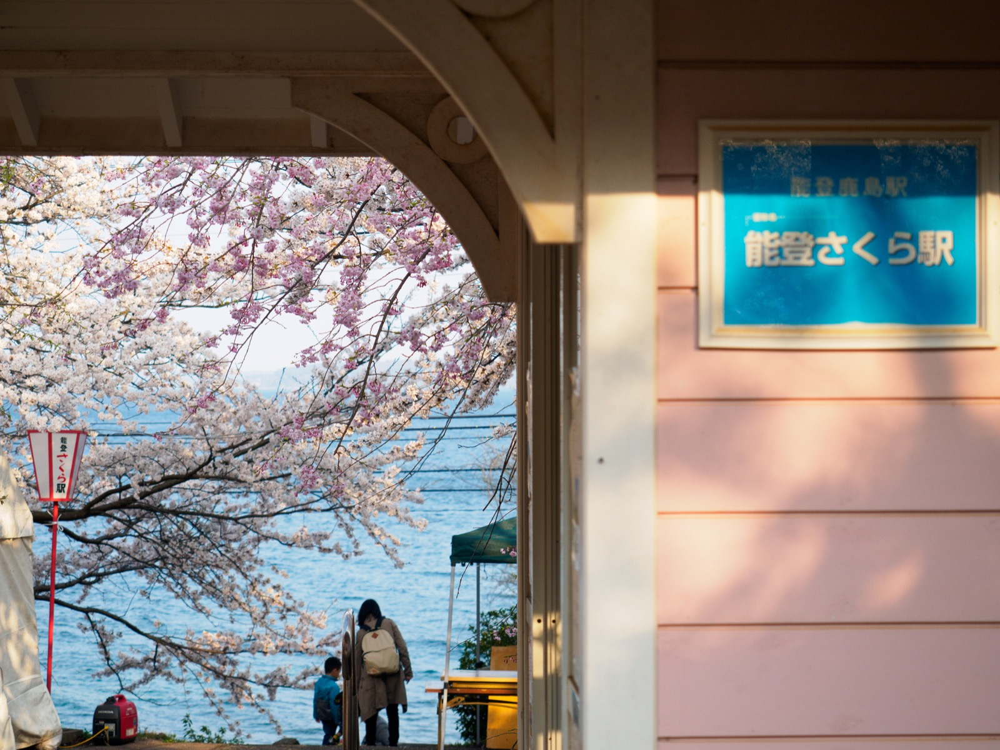
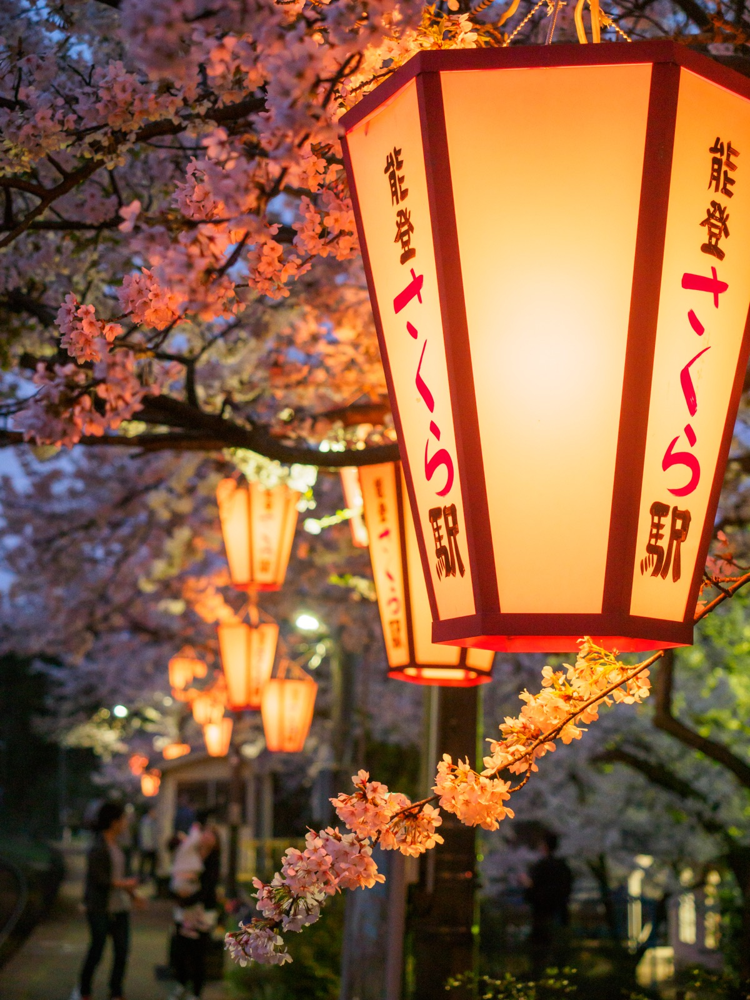

# 能登鹿島駅

---

青い七尾湾を背景に、視界いっぱいに広がる桜のトンネル。「能登さくら駅」という愛称を持つ能登鹿島駅は、能登半島でも屈指の桜の名所です。普段は海と山に囲まれた静かな無人駅ですが、春には多くの人で大賑わい。しかし、春が過ぎても、数十本の桜の木々が、夏は若葉、秋は紅葉、冬はイルミネーションで七変化。四季を通して旅人の目を楽しませてくれます。

金沢駅から特急と普通列車で約1時間半。本数は1時間に1本〜2時間に1本。無人駅。

**訪問：2008年8月、2017年4月 / 更新：2018年4月1日**

4月中旬、列車を降りるやいなや、桜のトンネルが出迎えてくれました。（2017年4月）

（2017年4月）

満開と好天と休日が重なり、子どもからお年寄りまで、多くの人々が訪れていました。（2017年4月）

列車の到着は、たまにしかないシャッターチャンス。（2017年4月）

桜越しに見えるのは、七尾湾と能登島。青と薄いピンク色のコントラストが眩しいです。（2017年4月）

南には、能登半島と能登島を結ぶ「ツインブリッジのと」も見えます。（2017年4月）

駅の外でも立派な桜の木が咲き誇っていました。（2017年4月）

頭上の桜だけでなく、足元のスイセンやチューリップも色とりどりで、見ていて飽きません。また、ぼんぼりが華やか。（2017年4月）

（2017年4月）

駅舎の正面にも桜と海がちらり。「能登さくら駅」の愛称に偽りはありません。（2017年4月）

駅舎も薄いピンク色。全方位を囲む桜の木々に埋もれそうです。無人駅なので、中には待合室とトイレしかありません。（2017年4月）

この桜並木は、のと鉄道の前身である国鉄七尾線が1932（昭和7）年に開通した際、地元の方が開通を祝って植えたものだそう。（2017年4月）

訪れた日はちょうど、年に1日だけの花見イベントの日。普段はお店もない駅前広場に、ずらりと出店が並んでいました。（2017年4月）

駅前広場をさらに下ると、国道249号線に出ます。穴水駅を結ぶ、[北鉄奥能登バス](http://www.hokutetsu.co.jp/route-bus) 鹿島線のバス停が目の前です。桜の時期は車で訪れる人も多く、国道は車で溢れていました。（写真は2008年8月）

駅前広場から駅舎を見て左側にホームへと続く坂道があり、こちらも満開の桜で覆われていました。坂を登った先には小さな広場もあります。（2017年4月）

観光列車の「[のと里山里海号](http://satoyama-satoumi-go.net/)」も到着。車内から写真を撮る人の姿も。（2017年4月）

やがて日の入りを迎えると、ぼんぼりが灯りました（[開花期間中のみ](http://blog.livedoor.jp/notosakuraeki/archives/52290888.html)）。（2017年4月）

柔らかな光が桜を照らします。（2017年4月）

（2017年4月）

夜もまた幻想的。小さな駅ながら、昼から夜まで桜を満喫できました。（2017年4月）

時は変わって、夏真っ盛りの8月。桜は深緑になり、ホームに涼やかな木陰を作ります。（2008年8月）

街も遠いため、人の姿はほとんどありません。（2008年8月）

（2008年8月）

海を向いても、春とはまた異なる趣が楽しめます。冬には [イルミネーション](https://www.facebook.com/nototetudou/posts/549283058562042) も行われるそう。季節を変えて、また訪れたくなる駅です。（2008年8月）
